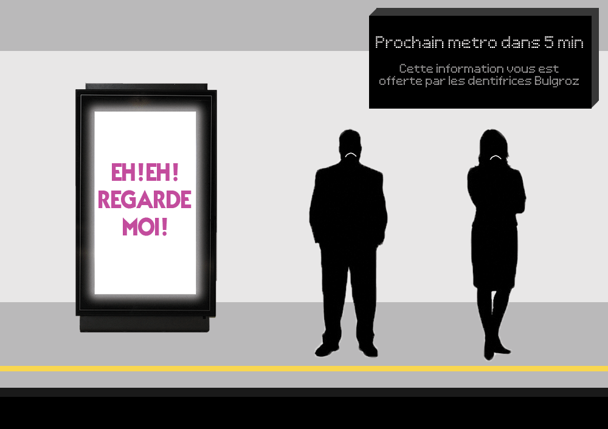
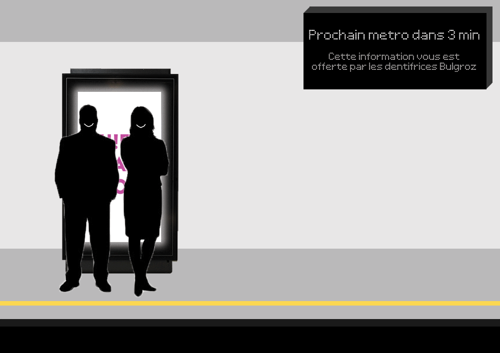
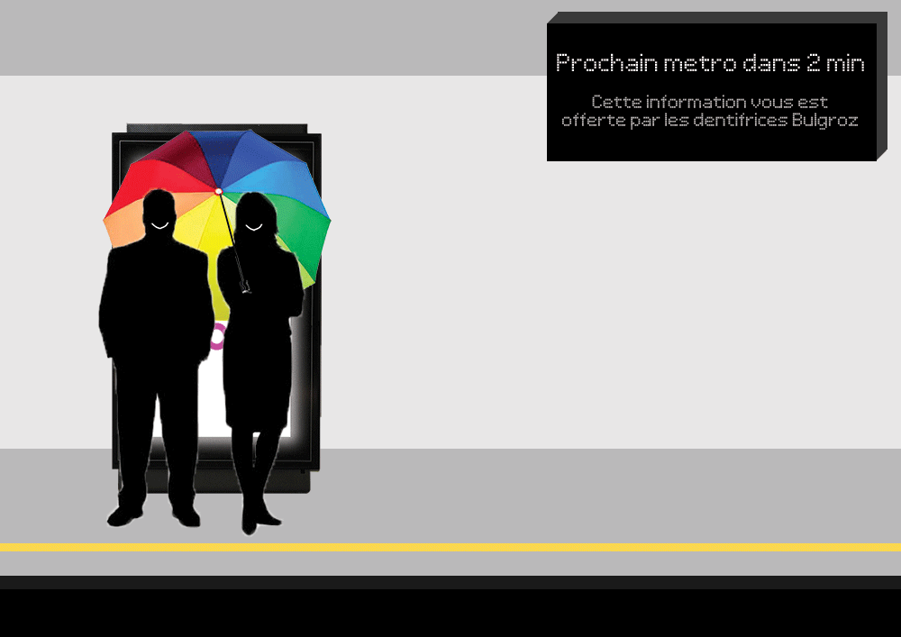
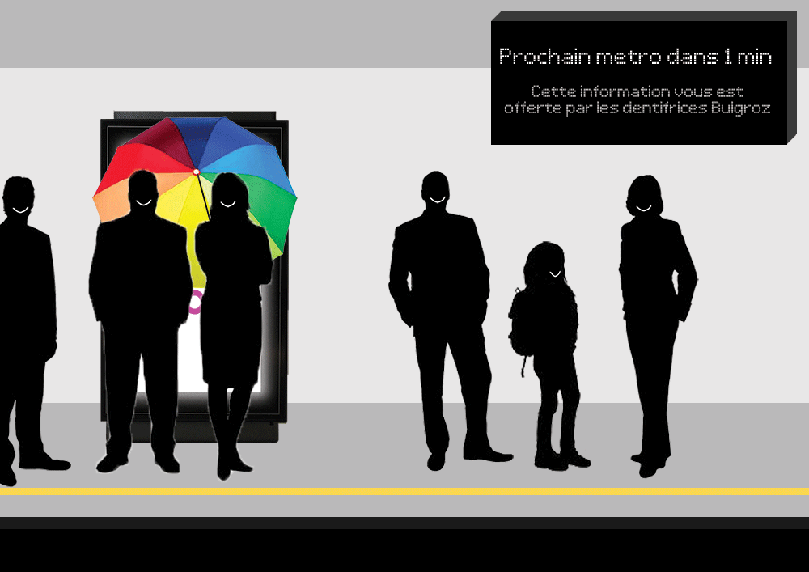
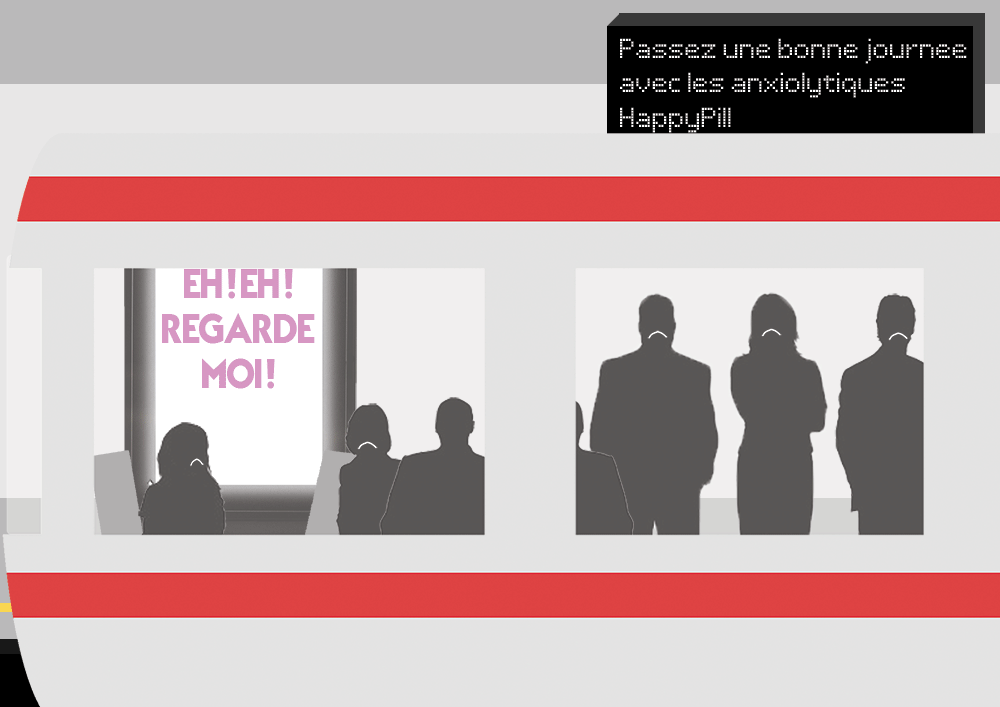

<a href="#FR" rel="alternate" hreflang="fr">FR</a> | <a href="#EN" rel="alternate" hreflang="en">EN</a>

<h3><a name="FR" href="#FR">FR</a></h3>

## Contexte
Depuis quelque temps, les quais de métros de Lyon (et d'ailleurs) sont envahis d'écrans de pub vidéos : "*les 13 stations les plus fréquentées [sont] dotées de près de 100 totems digitaux* [sic] *exclusivement installés sur les quais*", proposant ainsi "***une offre innovante et digitale qui s’adapte aux nouvelles attentes des usagers***" [d'après l'heureux exploitant](http://www.clearchannel.fr/presse/le-sytral-renouvelle-sa-confiance-a-clear-channel-pour-7-ans/). Pourtant, quand on leur demande vraiment aux *"usagers"*, [leurs attentes sont tout à fait différentes](https://www.20minutes.fr/paris/1968867-20161125-paris-vers-suppression-ecrans-publicitaires-metro). Devant cette montée en puissance de la capture attentionnelle des pécores (oui parce que bizarrement, il n'y a jamais d'écran de pub vidéo dans les salles d'attente 1ère classe, *quid* des *nouvelles attentes des usagers* ?!?), et en absence de toute possibilité de débat démocratique pour signaler notre opposition, il nous faut trouver des solutions pour **bloquer ces messages commerciaux non-sollicités** : [certains recouvrent](https://antipub.org/recouvrement-de-publicite/), mais ce type d'action prend du temps et de l'organisation, difficile de sortir son rouleau de papier au quotidien. Je souhaitais donc proposer une méthode moins efficace, mais plus facile à mettre en œuvre par tout un chacun au quotidien, et ne nécessitant aucun matériel : plus *scalable* ;)

## Tutoriel
### Pour cela, mettons nous en situation

Vous attendez le métro, et une pub vient pourvoir *aux nouvelles attentes des usagers* en vous délivrant ses 700W de flash lumineux dans la gueule : non-sollicité mais inratable, et il en vient de tous les cotés. Dans l'espoir d'y échapper, vous vous mettez à regarder le sol, dernier espace encore vierge de messages abrutissants. Pour le moment.

### Option 1 : Sortez couvert

* **Avantage** : réduit les maux de tête
* **Inconvénient** : on voit quand même vachement moins bien avec des lunettes de soleil en intérieur, et ya toujours ce p\*\*\*\*\* d'écran qui scintille. Sauf à vous équiper de [lunettes spécialement prévues à cet effet](https://www.youtube.com/watch?v=JI8AMRbqY6w).

### Option 2 : L'Ad-Blocker Humain

Vous avez quelques minutes à attendre sur ce quai, et il se trouve que **l'endroit où l'on voit le moins ces maudits écrans c'est en se mettant juste devant !** Autre intéret, et non des moindres : en mettant ainsi votre corps en opposition, vous jouer le rôle de **bloqueur de pub pour les autres !**

### Prendre de la place

Vous n'auriez pas un parapluie sur vous par hasard ? Les petits parapluies pliants qu'on peut garder dans son sac font parfaitement l'affaire, l'important c'est de prendre de la place.

### Faites passer le message !

Mettre son corps en opposition pour protéger les autres d'une agression, symboliquement c'est beau, non ? :') Profitez de l'occasion pour ouvrir la conversation sur le sujet !

Je suis curieux de voir jusqu'où ce type d'action peut aller : imaginons que tout le monde s'y mette et que les exploitants commencent à considérer cela comme un vrai problème, comment réagiront-ils ? Verra-t-on pousser sur ces écrans des petits pics comme on repousse les pigéons et les SDFs ? Sera-t-on verbalisé pour stationnement gênant la récolte attentionnelle ? Pour le savoir, il n'y a qu'un moyen : essayer !

[Mise à jour 17/06/2018] ça commence à prendre !! :) action de [Stop Pub Video - Le mouvement](https://www.facebook.com/Stop-Pub-Video-Le-mouvement-2060452440887836/)

### Limites

Une fois le métro arrivé, on ne peut pas demander aux bloqueurs de pub de garder leur poste (on va pas y passer la journée...), les flashs anxiogènes reprennent : c'est la plus grosse limite de ce système, c'est du très temporaire... Pour du plus long terme, il n'y a que l'action politique : le contrat sur les écrans dans le métro de Lyon est signé pour 7 ans donc ça risque d'être compliqué à faire sauter, mais **pour éviter que ces abominations arrivent à la surface, ça se joue maintenant** avec la concertation sur le Règlement Local de Publicité : **c'est le moment de [signez la pétition](https://web.archive.org/web/20190104021837/http://pleinlavue.org/)** et d'**[écrire à nos élus](http://pleinlavue.frama.io/generateur-d-email/)** !

### Quelques lectures
* [stop-pub.video - Appel à mobilisation le 3 février 2018](https://stop-pub.video)
* [pétition contre les écrans publicitaires dans les gares SNCF](https://petition.antipub.org/petition/5/)
* Sur Lyon : [Collectif Plein La Vue](https://web.archive.org/web/20190104021837/http://pleinlavue.org/)
* Sur le Web, le meilleur Ad&Tracker Blocker : [uBlock Origin](https://addons.mozilla.org/fr/firefox/addon/ublock-origin/) (je partage que le lien pour l'extension Firefox, et non Chrome : à quoi ça sert d'essayer de bloquer les trackers quand votre navigateur est lui-même construit par le plus grand vendeur de pub du web ?)
* Si vous avez un peu de temps : il y a de ça quelques années, j'avais tenté de [penser un système alternatif à la pub pour partager l'information sur les ressources dans une société connectée](https://maxlath.eu/articles/paper-ethical-marketing/) [en]

<h3><a name="EN" href="#EN">EN</a></h3>

## Context
For some time now, the metro platforms in Lyon (and elsewhere) have been invaded by advertisement video screens: "*the 13 stations with the most traffic [are] equiped with close to a 100 digital totems* [sic] *installed on platforms exclusively*", offering "***an innovative and digital solution adapted to users new expectations***" [according to the happy business running those [fr]](http://www.clearchannel.fr/presse/le-sytral-renouvelle-sa-confiance-a-clear-channel-pour-7-ans/). Meanwhile, when you really ask *"users"*, [there expectations are totally different [fr]](https://www.20minutes.fr/paris/1968867-20161125-paris-vers-suppression-ecrans-publicitaires-metro). In face of such a rise of lower class people's attention capture (as weirdly there are no video ad screens in 1st class waiting rooms: **what happenend to users new expectations?!?**), and given that we have no real democratic option to express our opposition, we need to find new solutions to **block those unsollicited commercial messages**: [some activists cover ads](https://antipub.org/recouvrement-de-publicite/) [link to an English equivalent of this page welcome], but this kind of action takes time and planning, that's hard to get your paper roll out of the bag on a daily basis. I would thus like to suggest a less effective method but easier to pull out by anyone in their daily life, and needing no particular material: more scalable ;)

## Tutorial
### The situation

You are waiting for a metro, and are confronted to an ad, gently providing to *users new expectations* by sending 700W of light flashes in your face: unsollicited but no way to miss it, and it comes from all sides. Hoping to preserve your eyes and nerves, you start looking at the ground, last place free of debilitating messages. For now.

### Option 1: Stay covered

* **Pros**: reduces headaches
* **Cons**: much harder to see indoor with sun glasses, and that fu\*\*\*g screen is still blinking. Unless you are equipped with [specially designed glasses](https://www.youtube.com/watch?v=JI8AMRbqY6w).

### Option 2: The Human Ad Blocker

You have some minutes to wait on this platform, and it happens that **the place where those damn screens are the least visible is when you are in front of them!** Another good point, and not the least: by putting your body in opposition, **you become an Ad Blocker for your peers!**

### Take space

You wouldn't have an umbrella with you by any chance? Small collapsible umbrellas that you can keep in your bag are perfect for that job, what matters is to take as much space as possible.

### Spread the message!

Using your body to protect others from an aggression, isn't that symbolically powerful? :') Take the chance to open the conversation on that issue!

I would be curious to see where this kind of action could go: imagine if everyone was starting to do that and that attention farmers started to consider it a real issue, how would they react? Will we see small picks grow on those screens, like the ones used to push back pigeons and homeless people? Will we get fined for parking obstructing attention harvesting? There is just one way to know: try!

[Mise à jour 17/06/2018] it starting to take off!! action by [Stop Pub Video - Le mouvement](https://www.facebook.com/Stop-Pub-Video-Le-mouvement-2060452440887836/)

### Limits

Once the metro arrived, we can't ask human ad blockers to keep their position all day, and those damn aggressive, anxiety-inducing flashes restart: that's the biggest limit of this solution, it's a very temporary one... For long term solutions, only political struggle can work: the contract for those screens in the metro of Lyon is signed for 7 years so that's gonna be hard to bust, but **to avoid that those abominations crawl to the surface, the time to act is now** as the *Règlement Local de Publicité* [local advertisement law] is being "discussed" publically: it's time to **[sign the petition](https://web.archive.org/web/20190104021837/http://pleinlavue.org//)** and to **[write our representatives](http://pleinlavue.frama.io/generateur-d-email/)**!

### Some readings
* On the web, the best Ad&Tracker Blocker: [uBlock Origin](https://addons.mozilla.org/fr/firefox/addon/ublock-origin/) (I'm only sharing the Firefox link, and not Chrome: what's the point of blocking trackers when your browser is built by the biggest ad business on the web?)
* If you have a bit of time: some years ago, I tried to [think an alternative system to advertisement to publish information on resources in a connected society](https://maxlath.eu/articles/paper-ethical-marketing/)
