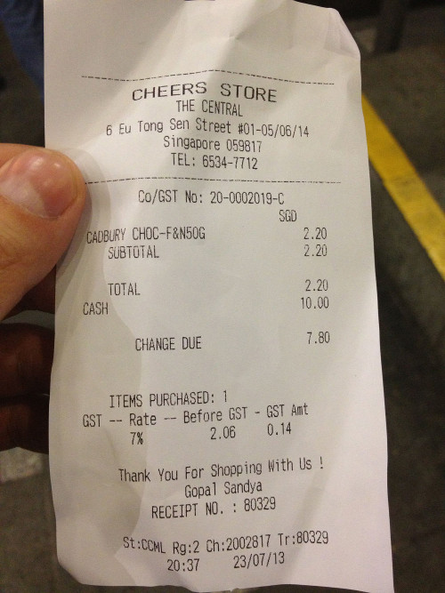
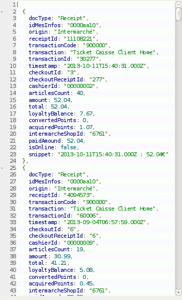
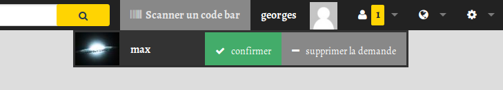
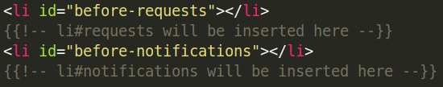
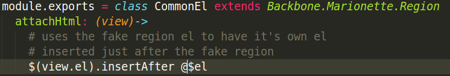
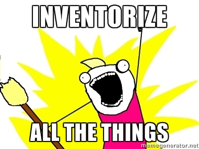

### Stratégies d'apprentissage et optimisation pour la flexibilité au service de l'utopie numérique
*"the only constant is change"*

--

#### Meetup Backbone 17/02/2015
[Maxime Lathuilière](http://maxlath.eu)
[@maxlath](https://twitter.com/maxlath)

retour sur la génèse d'[Inventaire](https://inventaire.io)

Note: retour d'XP. résumer 4 ans de travail en 15 minutes

---

Faites 's' pour ouvrir la popup avec les notes

---

### Origine du projet
repenser le marketing dans l'intéret des consommateurs/citoyens

--

mémoire: [maxlath.eu/paper-ethical-marketing](http://maxlath.eu/paper-ethical-marketing/)

Note: quelques mots sur mon parcours: master en management / mémoire de fin d'étude

---

publicité : les débuts

Note: frais ou pas frais, on parle du produit

---

<!-- .slide: data-background="img/free.jpg" -->

Note: peut-on remplacer la pub par des flux de données sur les ressources disponibles ? => peut-être résumé par la formule (next)

---

s/marketing/information sur les ressources disponibles/g

Note: s'inscrit dans un mouvement existant: les systèmes de VRM

---

### VRM
*Vendor Relationship Management*

outiller le consommateur pour rééquilibrer la relation commerciale

Note:

---

<!-- .slide: data-background="img/donnees-vendeur-consommateur-1.jpg" -->

Note: carte de fidelité = tracker client

---

<!-- .slide: data-background="img/donnees-vendeur-consommateur-2.jpg" -->

Note:

---

yaka demander (gentillement) aux entreprises d'ouvrir leurs **données-produits en format standard**, d'en rendre l'**usage libre**, et de nous envoyer le **lien** quand on passe à la caisse (plutôt qu'un bout de papier *so* XXième siècle), pour qu'on puisse **réutiliser/recroiser les données** via des outils dont ils n'ont pas le contrôle !

  =>

---

<!-- .slide: data-background="img/fuckallthat.gif" -->

Note: essais infructueux: entreprises radines en données / vous avez déjà fait un hackathon open data d'un grand groupe ?

---

### P2P-RM
*P2P Resources Management*

l'économie collaborative/horizontale comme laboratoire de transaction avec échanges de données ouvertes

--

article: [maxlath.eu/p2p-rm](http://maxlath.eu/p2p-rm/)

Note: contourner le problème du manque d'incentive tant que pas d'usage

---

### Objectifs du projet

Cartographier les ressources disponibles entre pairs avec des données ouvertes

= en faire l'**inventaire**

---

### Specs d'un outil garantissant l'intéret du citoyen

libre/open source <!-- { .element: style="text-align:left;" class="fragment roll-in"} -->

savoir libre <!-- { .element: style="text-align:left;" class="fragment roll-in"} -->

données en formats standard <!-- { .element: style="text-align:left;" class="fragment roll-in"} -->

contrôle des données par l'utilisateur <!-- { .element: style="text-align:left;" class="fragment roll-in"} -->

outil decentralisé <!-- { .element: style="text-align:left;" class="fragment roll-in"} -->

outil développé par une organisation ouverte et indépendante <!-- { .element: style="text-align:left;" class="fragment roll-"} -->

top of ze pop UX <!-- { .element: style="text-align:left;" class="fragment roll-in"} -->

Note: inscrire l'incorruptabilité dans la structure. pas de revente des données, pas de pub. vendor-lockin impossible : les utilisateurs restent parcequ'ils ont envie de rester

---

#Full-Stack Bisounours

---

“A prototype is worth a thousand meetings.”

~ Mike Davidson, VP of Design, Twitter <!-- .element: style="color:#aaa" -->

Note:  yapluka

---

<!-- .slide: data-background="img/weeds.gif" -->

### "bonjour, je sors d'école de commerce et j'ai une super idée, tu veux être mon CTO?" <!-- { .element: style="color: #222"} -->

Note: pas de cash, pas d'experience, pas de clients. des difficultés de réaliser un proto quand on est pas dev

---

### devenir son propre associé technique

Note: pas de cash => investissement en temps

---

expérience technique : 0

don de voyance : 0

### sur quelles technos parier ?

---

### "startegie d'apprentissage"

---

<!-- .slide: data-background="img/warfog.jpg" -->

# tâtonner <!-- .element: style="color:#fff" -->

---

### Bouillonnement des technos décentralisées

Social Web : RWW, WebID  <!-- { .element: class="fragment roll-in"} -->

Unhosted : RemoteStorage, PouchDB  <!-- { .element: class="fragment roll-in"} -->

Personal Clouds : CozyCloud, OwnCloud...  <!-- { .element: class="fragment roll-in"} -->

Internet reboots: Etherium, MaidSafe...  <!-- { .element: class="fragment roll-in"} -->

---

### web décentralisé : faible adoption / immaturité
=> commencer en web classique / centraliser autour d'un server, mais en gardant la possibilité d'évoluer

---

# Javascript

- language standard du web
- unhosted, server-less, read-write-web, node-webkit, cordova/phonegap : JS comme point commun

Note: Unhosted, clients lourds => JS. + avantage structurel comme language standard du web + flexibilité server-less, node-webkit...

---

“A prototype is worth a thousand meetings.”

~ Mike Davidson, VP of Design, Twitter <!-- .element: style="color:#aaa" -->

Note: et comme un proto blablabla (next)

---

## Vite Vite Vite !!

*fail early fail often*

~ sagesse Lean <!-- .element: style="color:#444" -->

Note: apprentissage JS // proto

---

1er proto: Meteor

Note: avant la 1.0, evolution chaque semaine

---

*"facile même pour les débutants"*

---

j'ai essayer de lire le code de Meteor

 <!-- { .element: class="fragment roll-in"} -->

je m'y suis cassé les dents <!-- { .element: class="fragment roll-in"} -->

Note: tout va bien tant que ça va. pas fait pour être compris, juste utilisé et que tout marche comme par magie

---

# [culte du cargo](https://fr.wikipedia.org/wiki/Culte_du_cargo)

---

fail early fail often: mon cul

Note: apprendre, ça prend du temps

---

<!-- .slide: data-background="img/backbone.png" -->

### lesson learned <!-- .element: style="margin-top:10em" -->

Note: là, le storytelling devrai me faire dire que je me suis résolu à ne prendre plus que des petits outils, au code lisible et que je suis tombé amoureux de Backbone.js, que nous vécure heureux et eurent beaucoup d'enfants

---

# FAUX

Note: dans ce brouillard général, j'ai été très chanceux

---

## app CozyCloud

Stack: <!-- { .element: style="text-align:left"} -->

Coffeescript <!-- { .element: class="fragment roll-in" style="text-align:left"} -->

NodeJs / ExpressJs <!-- { .element: class="fragment roll-in" style="text-align:left"} -->

BackboneJs <!-- { .element: class="fragment roll-in" style="text-align:left"} -->

Brunch <!-- { .element: class="fragment roll-in" style="text-align:left"} -->

CouchDB <!-- { .element: class="fragment roll-in" style="text-align:left"} -->

Note: concours MesInfos (VRM). Cozy en 2 mots. j'ai tout pompé

---

tip a posteriori:

*qu'utilisent ceux qui essayent de résoudre les mêmes problèmes ?*

---

### Full Stack bernard l'hermite

Note: Les bernard l'hermite se caractérisent par le fait qu'ils possèdent en général un abdomen mou dépourvu de carapace. Par conséquent, ils occupent pour se protéger des abris qui, pour la majorité des espèces, sont formés par des coquilles de gastéropode mais aussi des éponges ou des bambous.*

---

Et là, tout s'est bien passé

---

Ou presque

concepts MVC - *this* - *hoisting* - *async* - *prototypal inheritence*...

Note: 3 mois de galère. dans le doute, j'attachais tout à *window*. Mais au moins, j'apprends javascript, pas un framework

---

### Reprendre cette base pour un nouveau proto et étoffer

=> aménager la coquille

Note: le concours passé, commence le proto Inventaire

---

- faciliter les layouts
- modulariser / découpler

Note: choix par la doc trouvée / importance de la communauté / maturité

---

### L'été/automne à bidouiller

---

### créer un système d'authentification

 <!-- { .element: class="fragment roll-in" } -->

Note: Persona vs unknown crypto

---

### créer un réseau social

 <!-- { .element: class="fragment roll-in" } -->

Note: Neo4J propaganda "you need a graphDB to do graphs". LevelGraph => pb réplication Levelup => retour CouchDB

---

### créer une UX top of the pop

framework CSS/JS <!-- .element: class="fragment roll-in" -->

VS <!-- .element: class="fragment roll-in" -->

lib MVC <!-- .element: class="fragment roll-in" -->

Note: Foundation topbar vs $el => Flexbox => problème de compatibilité

---

<!-- .slide: data-background="img/anneau.jpg" -->

### un DOM pour les gouverner tous <!-- .element: style="color:white" -->

---

<!-- .slide: data-background="#222" -->

Note: exemple: attacher des views à la top bars Foundation

---

### plug&play task-runner plugins

Note: Remplacer les wrap de wrap d'outil par les outils dans un script. (ex: browserify, gzip, cssnext...) la docu des plugins présupposent que vous connaissez déjà l'outil. maitenance hasardeuse

---

### rule of thumb
*plus un outil est packagé, plus vous êtes dépendant de mainteneurs de projets*

=> retourner à la source

---

<!-- .slide: data-background="#000" -->

### package.json: <!-- .element: style="color:#666" -->

"build": "./scripts/build" <!-- .element: style="text-align:left; color:white" -->

### ./scripts/build: <!-- .element: style="color:#666" -->

brunch build --production <!-- .element: style="text-align:left; color:white" -->

./scripts/minify <!-- .element: style="text-align:left; color:white" -->

./scripts/gzip <!-- .element: style="text-align:left; color:white" -->

./scripts/update_i18n_files <!-- .element: style="text-align:left; color:white" -->

---

### héberger le site: les PAAS

---

### héberger le site: les PAAS

Note: Nodejitsu $48/mois pour un SSL => VPS // Nginx // apt-get // Couchdb

---

<!-- .slide: data-background="img/seul-au-monde.jpg" -->

###  l'apprentissage peut parfois sembler un peu long <!-- .element: style="color:white; text-shadow: 2px 0 0 #222; padding-top: 10em; " -->

Note: 8 mois de prototypage

---

<!-- .slide: data-background="img/stack.png" -->

---

<!-- .slide: data-background="img/inventaire.png" -->

[Inventaire.io](https://inventaire.io) <!-- .element: style="color:white" -->

[@inventaire_io](https://twitter.com/inventaire_io) <!-- .element: style="color:white" -->

Note: aperçu de https://inventaire.io/inventory/

---

<!-- .slide: data-background="img/inventory.png" -->

---

### Status du respect des specs

* libre/open source <!-- .element: class="fragment roll-in" style="color:green" -->
* savoir libre <!-- .element: class="fragment roll-in" style="color:#ffd000" -->
* données en formats standard <!-- .element: class="fragment roll-in" style="color:red" -->
* contrôle des données par l'utilisateur <!-- .element: class="fragment roll-in" style="color:#ffd000" -->
* outil decentralisé <!-- .element: class="fragment roll-in" style="color:red" -->
* outil développé par une organisation ouverte et indépendante <!-- .element: class="fragment roll-in" style="color:green" -->
* top of ze pop UX <!-- .element: class="fragment roll-in" style="color:#ffd000" -->

Note: AGPL3/repo github public. Peut faire mieux

---

### savoir libre

Note: [Q535](https://wikidata.org/entity/Q535) et [wd:Q535](https://inventaire.io/entity/wd:Q535)

---

### encore tellement de fonctionnalités manquantes

- groupes
- real-time
- messageries
- suivi des transactions
- intégration continue
...

---

### prendre son temps

(mais en allant vite)

Note: la facilité mêne au coté obscure de la complexité

---

les plus du zero-magic: la configurabilité

les moins du zero-magic: la configurabilité <!-- { .element: class="fragment roll-in"} -->

Note: voir analytics couchdb view / http

---

### apprendre en mode bourrin

réaliser un projet de A à Z  <!-- { .element: style="text-align:left" class="fragment roll-in"} -->

regarder des conf au ptit dej  <!-- { .element: style="text-align:left" class="fragment roll-in"} -->

aller à des meetups  <!-- { .element: style="text-align:left" class="fragment roll-in"} -->

lire la doc / des bouquins/ le code  <!-- { .element: style="text-align:left" class="fragment roll-in"} -->

lire les articles de dev expérimenté(e)s  <!-- { .element: style="text-align:left" class="fragment roll-in"} -->

lire des dev expérimenté(e)s blablater sur twitter  <!-- { .element: style="text-align:left" class="fragment roll-in"} -->

lire lire lire  <!-- { .element: style="text-align:left" class="fragment roll-in"} -->

essayer essayer essayer  <!-- { .element: style="text-align:left" class="fragment roll-in"} -->

---

on ne peut pas comprendre un outil sans avoir fait l'experience du problème qu'il tente de résoudre

Note: pour comprendre un problème et les solutions techniques packagé par tel ou tel framework, il faut l'avoir affronté, sinon c'est de la magie. Une grande partie de la notre métier consiste à comprendre le contexte dans lequel s'articule les outils : ne laisser pas les frameworks vous voler l'occasion d'apprendre ('fin c'est un équilibre à trouver)

---

### du coup je commence à voir venir les arnaques

*"get your facebook-killer app working in minutes"* <!-- { .element: class="fragment roll-in"} -->

*"focus on doing what you like, while we care for the rest"* <!-- { .element: class="fragment roll-in"} -->

 <!-- { .element: class="fragment roll-in"} -->

---

<!-- .slide: data-background="img/dentist.gif" -->

### vous avez le bonjour de mon dentiste <!-- .element: style="color:white" -->

Note: beaucoup de cassage de dents plus tard

---

If you like it put a PR on it: [github.com/maxlath/inventaire](https://github.com/maxlath/inventaire)

--

[Maxime Lathuilière](http://maxlath.eu) - [@maxlath](https://twitter.com/maxlath)

[Inventaire.io](https://inventaire.io) - [@inventaire_io](https://twitter.com/inventaire_io)

Note: questions ?